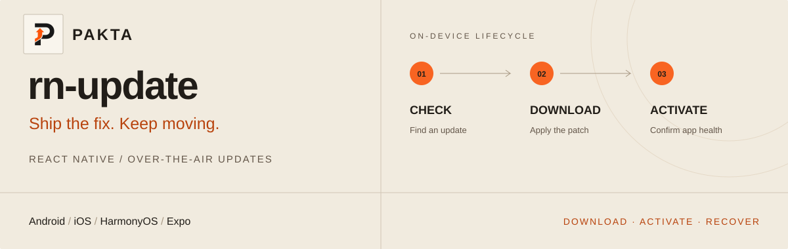

<!--
[INPUT]: 依赖 SDK 公开 API、平台接入示例与 Pakta 选型文档
[OUTPUT]: 提供英文产品介绍、CodePush/Expo 选型入口与接入指南
[POS]: SDK 的 GitHub/npm 英文入口，与 README-CN.md 保持语义一致
[PROTOCOL]: 变更时更新此头部，然后检查 CLAUDE.md
-->
# rn-update — React Native & Expo OTA Updates



[](https://www.npmjs.com/package/rn-update)
[](./LICENSE)
[](#platforms)

### Ship the fix. Keep moving.

Ship **React Native and Expo OTA updates** with **Pakta**. Looking for a **CodePush alternative** or comparing **EAS Update**? rn-update is an open-source SDK with differential downloads, staged rollouts and crash rollback for **iOS, Android and HarmonyOS**.

Keep your existing project, integrate the SDK and ship a new app build. Then deliver JavaScript and asset updates over the air to users on that build.

[简体中文](./README-CN.md) · [Pakta](https://pakta.site/en/) · [Quick start](#quick-start) · [Code integration guide](https://pakta.site/en/docs/integration/) · [CLI](https://github.com/pakta-team/rn-update-cli/blob/main/README.md) · [Pricing](https://pakta.site/en/pricing/)

---

## Your update. Your rollout.

| Capability | What it brings to your app |
| --- | --- |
| **Differential downloads** | Transfer patches instead of repeating unchanged content; savings depend on the build |
| **Staged rollouts** | Target channels, native versions and rollout percentages through the service |
| **Flexible activation** | Download silently, activate later, or prompt your users |
| **Crash recovery** | Health checks, rollback and a native cold-start repair path |
| **Observability** | Update state, download progress and Sentry / Crashlytics integration |

## CodePush alternative: move to Pakta

Bring your existing React Native app to Pakta for differential updates, controlled rollouts and crash recovery. Integrate `rn-update`, configure your channels and publish with the **pakta CLI**. Ship a new app build containing the SDK to start delivering Pakta OTA updates to your users.

**[CodePush migration guide →](https://pakta.site/en/docs/codepush-alternative/)**

## Expo Updates / EAS Update alternative

Use Pakta for **Expo OTA updates** in development and production builds. Manage React Native, Expo and HarmonyOS updates from one platform, with differential delivery and clear annual plans.

Compare the SDK integration, update workflow and bandwidth costs before choosing your setup. Pakta uses `rn-update` and the pakta CLI; migrating from `expo-updates` includes native integration and a new app build.

**[Expo Updates vs Pakta: integration and costs →](https://pakta.site/en/docs/expo-updates-vs-pakta/)** · **[Pakta plans and bandwidth comparison →](https://pakta.site/en/pricing/)**

## Quick start

### 1. Install and configure native integration

```bash
npm install rn-update
```

On iOS, also run `pod install` in the `ios` directory. Configure **native bundle loading and build metadata** using the examples below, then rebuild your app.

<a id="platforms"></a>

| Platform | Integration example |
| --- | --- |
| Android / iOS | [React Native](./Example/testHotUpdate) |
| Expo | [Development / production build](./Example/expoUsePakta) |
| HarmonyOS | [RNOH](./Example/harmony_use_pakta) |

> Expo requires a development or production build containing this native module; Expo Go is not supported. Native code or dependency changes require a new native binary.

Expo apps can also declare the config plugin to pin the distribution channel into the native package:

```json
{
  "expo": {
    "plugins": [["rn-update", { "channel": "staging" }]]
  }
}
```

`channel` is the only value this plugin writes to the native project — `appKey` and server endpoints stay in the JS client, so configuration has a single source of truth. Omit `channel` to keep the default channel.

### 2. Connect Pakta at the root

Get your platform-specific `appKey` from the dashboard and create the client outside the component:

```tsx
import { Pakta, PaktaProvider } from 'rn-update';
import App from './App';

const client = new Pakta({
  appKey: 'YOUR_PLATFORM_APP_KEY',
  updateStrategy: 'silentAndLater',
});

export default function Root() {
  return (
    <PaktaProvider client={client}>
      <App />
    </PaktaProvider>
  );
}
```

By default, the client uses `https://pakta.yoghourt.space/api` and checks at startup and on resume. Use the public `appKey` in the app; keep personal access tokens in CLI / CI.

### 3. Publish your first update

Configure native integration → install a release build → register it with the CLI → bundle and roll out.

**[→ Follow the CLI publishing guide](https://github.com/pakta-team/rn-update-cli/blob/main/README.md#quick-start)**

Verify download, activation and health confirmation on a device before widening rollout. Channel identity comes from native package metadata.

## Update policies

| Setting | Behavior |
| --- | --- |
| `updateStrategy: 'silentAndLater'` | Downloads silently for a later launch |
| `updateStrategy: 'silentAndNow'` | Switches after download and can interrupt active work |
| `updateStrategy: 'alertUpdateAndIgnoreError'` | Prompts for updates and suppresses check errors; production default |
| `updateStrategy: 'alwaysAlert'` | Shows update and error alerts |
| `checkStrategy: 'both'` | Checks at startup and on resume; default |
| `checkStrategy: null` | Disables automatic JS checks; native checks can still download without normal automatic activation |

The exported [`ClientOptions`](./src/type.ts) covers hooks, retries, localization and logging. Change options with `client.setOptions(...)`. Use `useUpdate()` for update state and actions, or `useUpdateProgress()` for a separate progress subscription.

## Advanced configuration

<details>
<summary><strong>Health checks, crash recovery and error reporting</strong></summary>

- The Provider marks success after 1000 ms by default. Use `autoMarkSuccessDelayMs` and `healthCheck` for delayed critical initialization; returning `false` keeps crash protection armed.
- Native cold-start checks can fetch a fix when JavaScript cannot start. Setting `disableNativeCheck: true` disables this recovery path. Recovery still requires connectivity, valid configuration and an available fix.
- `getUpdateMetadata()`, `attachToSentry()` and `attachToCrashlytics()` associate crashes with update identity. Use `client.captureException()` to report JavaScript errors manually.
- `disableTelemetry` disables telemetry and JS error transport; `disableErrorReporting` disables only JS error transport. Keep tokens and personal information out of error context.

</details>

<details>
<summary><strong>Connect your own service</strong></summary>

When using another deployment, configure its service and endpoint discovery URLs explicitly:

```tsx
const client = new Pakta({
  appKey: 'YOUR_PLATFORM_APP_KEY',
  server: {
    main: ['https://YOUR_HOST/api'],
    queryUrls: ['https://YOUR_CDN/endpoints.json'],
  },
  updateStrategy: 'silentAndLater',
});
```

`queryUrls` must provide an endpoint list for your deployment. See the [default endpoint list](https://cdn.jsdelivr.net/gh/pakta-team/rn-update@main/endpoints.json); keep the repository-root and SDK copies synchronized when maintaining the default service.

</details>

<details>
<summary><strong>React Native version compatibility</strong></summary>

Peer dependencies declare React ≥16.8 and React Native ≥0.59. This is not a test guarantee for every version and architecture combination. Validate your target platform, architecture and React Native version in a release build.

</details>

## Documentation & license

- [Native checks and activation protocol](./NATIVE_CHECKUPDATE_DESIGN.md)
- [Public API exports](./src/index.ts)
- [License: MIT](./LICENSE)

Copyright (c) 2026 Yoghourt Technology(BeiJing) Company Limited.
